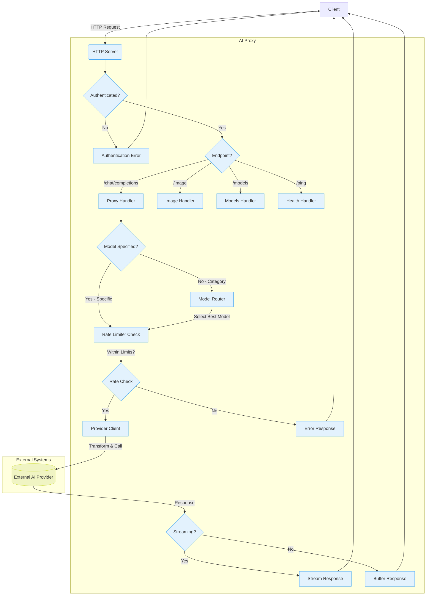

## System Architecture

### Component Roles:

1. **HTTP Server** (`internal/server`):
   - Entry point handling HTTP requests/responses
   - Initializes server with configuration from environment variables and files
   - Registers routes and applies middleware
   - Manages server lifecycle (start, stop, graceful shutdown)
   - Supports CLI flags for configuration overrides
   - Handles server configuration including port, authentication, and address

2. **Authentication Middleware** (`internal/middleware`):
   - Validates the Authorization header for all protected endpoints
   - Returns proper WWW-Authenticate headers for security compliance
   - Provides secure error handling without information disclosure
   - Supports Bearer token authentication
   - Can be reloaded with new authentication tokens

3. **Proxy Handler** (`internal/handlers/proxy.go`):
   - Handles text generation requests (`/chat/completions`)
   - Supports both legacy and v1-compatible paths for OpenAI compatibility
   - Processes incoming requests and determines if a specific model is requested or if model selection is needed
   - Manages the complete request lifecycle from receiving the client request to returning the response
   - Handles both streaming and non-streaming responses appropriately
   - Implements error handling and fallback mechanisms when provider calls fail
   - Uses buffer pooling for efficient memory management
   - Implements retry mechanisms for streaming requests

4. **Image Handler** (`internal/handlers/image.go`):
   - Handles image generation requests (`/image`)
   - Routes requests to appropriate providers based on model selection
   - Processes responses from image generation providers
   - Uses buffer pooling for efficient memory management

5. **Models Handler** (`internal/handlers/models.go`):
   - Handles models listing requests (`/models`)
   - Returns available models in OpenAI-compatible format
   - Includes both specific models and size categories (SMALL/BIG)

6. **Health Handler** (`internal/handlers/health.go`):
   - Handles health check requests (`/ping`)
   - Returns simple "OK" response for service health monitoring
   - No authentication required

7. **Model Router**:
   - Validates requests against model capabilities
   - Selects optimal provider based on:
     - Request length vs model limits
     - Current rate limits
     - Provider priority
   - Implements intelligent model selection when client specifies size categories (SMALL/BIG) rather than specific models
   - Handles fallback mechanisms when primary models fail
   - Iterates through available models to find the best match for the request
   - Considers model priority and last request time for load balancing
   - Ensures request length does not exceed model's maximum request length
   - Selects models based on size category when specific model is not requested

8. **Rate Limiter** (`internal/config`):
   - Tracks usage per model (minute/hour/day)
   - Enforces configured limits
   - Updates usage metrics
   - Implements fine-grained locking with `sync.Mutex` for each rate limit to ensure thread safety
   - Automatically resets counters based on time windows (minute, hour, day)
   - Provides circuit breaker pattern by setting maximum limits after errors
   - Uses fine-grained locking with individual `sync.Mutex` for each rate limit to ensure thread safety
   - Maintains separate counters for minute, hour, and day usage
   - Updates last request time for each model
   - Implements automatic counter resets based on time windows
   - Provides circuit breaker functionality by setting maximum limits after errors to temporarily pause requests

9. **Provider Adapter** (`internal/provider`):
   - Uses centralized HTTP client factory for all external calls
   - Translates requests to provider-specific formats
   - Handles authentication/authorization
   - Standardizes responses
   - For streaming requests, it facilitates a direct pipe of the response body back to the client.
   - Applies configurable timeouts and connection pooling settings
   - Implements provider-specific throttling mechanisms with request queues
   - Handles both JSON and streaming response formats
   - Each provider implements the standardized `Provider` interface with `Call` method (defined in `internal/schema/schema.go`)
   - Manages provider-specific authentication tokens and API keys
   - Handles provider-specific request/response transformations
   - Supports streaming responses for providers that implement it (like OpenRouter)
   - Uses a centralized HTTP client factory for consistent configuration across all providers

10. **AI Provider**: External LLM service APIs
   - Supports multiple providers including OpenAI, Google Gemini, Sberbank GigaChat, Groq, Cloudflare, OpenRouter, and others
   - Each provider has its own client implementation with provider-specific logic
   - Handles authentication tokens and API keys
   - Manages provider-specific request/response transformations
   - Implements provider-specific logic for authentication, request formatting, and response processing
   - Each provider client is created with specific configuration parameters including timeouts and connection pooling settings
   - Supports both streaming and non-streaming responses depending on provider capabilities

### Architecture Patterns:

1. **Plugin Pattern**:
   - Each AI provider is implemented as a plugin with a standardized interface
   - New providers can be added by implementing the `Provider` interface
   - Provider selection is dynamic based on configuration
   - Provider-specific logic is encapsulated within each provider's client
   - All providers implement the `Provider` interface with a `Call` method (defined in `internal/schema/schema.go`)
   - Provider clients are created dynamically based on configuration in the YAML file
   - Provider-specific logic is isolated within each provider's implementation

2. **Factory Pattern**:
   - Centralized HTTP client factory creates configured HTTP clients for all providers
   - Each provider client is created with specific configuration parameters
   - HTTP client settings (timeouts, connection pooling) are configurable per provider
   - Consistent client creation across all provider implementations
   - The `client.NewHttpClient` function creates configured HTTP clients based on `HttpClientConfig` (defined in `internal/schema/schema.go`)
   - Configuration includes timeout settings and idle connection timeout
   - Each provider client uses the factory to create its HTTP client with provider-specific settings

3. **Strategy Pattern**:
   - Model selection strategy based on request size, rate limits, and priority
   - Provider-specific request/response handling strategies
   - Streaming vs. non-streaming response handling strategies
   - Error handling strategies with fallback mechanisms
   - Model selection algorithm considers multiple factors including request length, rate limits, and model priority
   - Different providers have different request/response handling implementations
   - Streaming responses are handled differently from buffered responses
   - Fallback mechanisms attempt alternative models when primary models fail

4. **Circuit Breaker Pattern**:
   - Rate limiter acts as a circuit breaker by setting maximum limits after errors
   - Provider-specific throttling with request queues prevents overwhelming external services
   - Automatic recovery after time windows expire
   - Error-based fallback to alternative providers
   - When a provider call fails, the rate limiter sets maximum limits to temporarily pause requests
   - Automatic counter resets allow recovery after time windows expire
   - Model selection can fallback to alternative providers when primary providers fail

### Key Implementation Details:

1. **Concurrency**:
   - Fine-grained locking with `sync.Mutex` for individual rate limits
   - Provider-specific request queues to serialize requests to external services
   - Thread-safe access to shared model and rate limit data structures
   - Context-aware request handling with cancellation support
   - Each rate limit has its own mutex to minimize lock contention
   - Shared data structures for models and rate limits are accessed in a thread-safe manner
   - Context is used for request handling to support cancellation

2. **Performance**:
   - Connection pooling through centralized HTTP client factory with optimized settings (MaxIdleConns: 200, MaxIdleConnsPerHost: 50)
   - Configurable timeouts to prevent hanging requests
   - Efficient JSON processing with GJSON/SJSON libraries
   - Streaming responses avoid buffering large payloads in memory
   - Provider-specific throttling prevents rate limit violations
   - HTTP client factory implements connection pooling for efficient resource usage
   - JSON processing uses GJSON/SJSON for high-performance parsing and manipulation
   - Streaming responses use `io.Copy` to efficiently pipe data without buffering
   - Standardized error handling with provider-specific error structures (defined in `internal/schema/schema.go`)
   - Buffer pooling with `sync.Pool` for efficient memory management (1K, 4K, 16K buffer sizes)
   - Streaming retry mechanism with exponential backoff and jitter for resilient connections

3. **Resource Management**:
   - Centralized configuration management through YAML
   - Automatic cleanup of request queues and connections
   - Memory-efficient streaming for large responses
   - Proper resource disposal with deferred cleanup functions
   - Idle connection timeout configuration to prevent resource leaks
   - Configuration is managed through YAML files with structured data
   - Resources like HTTP connections are properly closed using defer statements
   - Idle connection timeouts prevent resource leaks from abandoned connections
   - Buffer pooling reduces garbage collection pressure by reusing byte slices and readers

4. **Error Handling**:
   - Structured error handling with typed errors for different error conditions
   - Retryable error detection for automatic recovery
   - Standardized error format across all providers
   - Proper error wrapping and chaining for debugging
   - Secure error responses without information disclosure

5. **Security**:
   - Bearer token authentication middleware with proper security headers
   - Secure error handling without information disclosure
   - Configuration management with environment variables for sensitive data
   - Rate limiting to prevent abuse
   - Proper validation of requests and responses

6. **Modularity**:
   - Clear separation of concerns with dedicated packages for each functionality
   - Handler layer for HTTP request processing
   - Middleware layer for cross-cutting concerns
   - Server layer for HTTP server initialization and route registration
   - Business logic layer for core functionality (config, bufferpool, errors, stream)
   - Provider adapters for AI service integration
   - Shared utilities for common functionality (client, schema)
   - Dependency injection to eliminate global state

7. **Observability**:
   - Structured logging with appropriate log levels
   - Error categorization with specific error types
   - Metrics collection points for monitoring
   - Health check endpoint for service monitoring
   - Retry callback mechanisms for tracking retry attempts